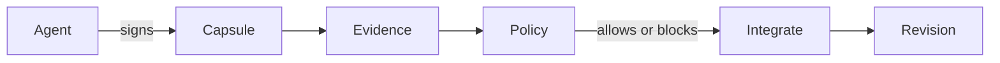

# Claw VCS, SLSA, GitHub Attestations, and Sigstore

These systems overlap, but they operate at different layers.

| System | Primary claim |
|---|---|
| SLSA provenance | How a build artifact was produced. |
| GitHub artifact attestations | Which GitHub workflow produced an artifact for a repository and commit. |
| Sigstore/Cosign | A signature and transparency-log-backed identity story for artifacts or blobs. |
| Claw VCS | Source-history-level provenance: intent, change, revision, capsule, evidence, and policy as repository objects. |

Claw VCS should use release attestations and Sigstore for its own binaries. Inside a Claw repository, capsules and policies answer a different question: what evidence was claimed for this source revision, which key signed it, and did repository policy allow it?

