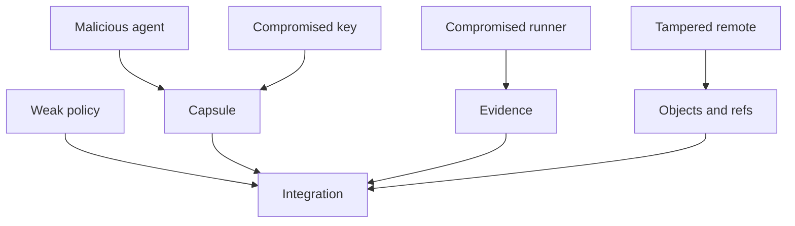

# Threat Model

This document defines what Claw VCS provenance is intended to prove, what it cannot prove, and which trust assumptions remain outside the repository.

## Security Goals

- Bind intents, changes, revisions, capsules, evidence, and policies to content-addressed repository objects.
- Verify that a capsule signature was produced by a specific key over a specific capsule payload.
- Verify that evidence claims reference the expected revision and required policy checks.
- Detect object corruption through COF decoding, CRC checks, content hashes, and signature verification.
- Preserve policy configuration as repository data instead of relying only on external project settings.

## Non-Goals

- Claw VCS does not prove that code is correct.
- Claw VCS does not prove that a test suite is sufficient.
- Claw VCS does not prove that an AI agent behaved safely.
- Claw VCS does not replace CI isolation, runner hardening, secret management, code review, or human judgment.
- Claw VCS does not make a compromised signing key trustworthy.

## Trust Assumptions

- Local machines that write repository data are trusted to protect workspace contents, private keys, and auth tokens.
- Agent signing keys are generated, stored, rotated, and revoked by a trusted operator process.
- Evidence runners are trusted to execute the commands they claim and to protect logs and artifacts from tampering before signing.
- Maintainers are trusted to configure policies that represent the repository's actual risk tolerance.
- Remotes are treated as storage and transport; clients verify object identity and signatures instead of trusting remote claims alone.

## Capsule Claims

A capsule can prove that a key signed a payload containing:

- revision ID
- public evidence fields
- optional encrypted private metadata
- signer identity or key ID
- signature bytes

A capsule does not prove that the signer was honest, that the execution environment was uncompromised, or that the evidence is meaningful. Policy must decide which signer keys, runner keys, evidence fields, freshness windows, and trust domains are acceptable.

## Agent Lies

If an agent lies in public fields or evidence claims, the signature only makes the lie attributable. Mitigations:

- require evidence from trusted runner keys, not only agent keys
- require logs and artifacts to hash-match the evidence record
- require exact revision binding
- require freshness windows
- require human review or quarantine for sensitive paths

## Agent Key Leak

If an agent key leaks, an attacker can produce valid signatures until the key is revoked. Response:

1. Revoke the key in policy or trusted-key configuration.
2. Rotate the affected agent identity.
3. Audit capsules signed by the revoked key.
4. Re-run required checks from trusted runners for affected revisions.
5. Treat any private metadata accessible to the key as potentially exposed.

## CI or Runner Compromise

A compromised runner can sign false evidence. Mitigations:

- isolate runners by trust domain
- bind evidence to revision ID, command, exit code, environment digest, log digest, artifact digest, and timestamps
- require multiple independent checks for high-risk changes
- expire evidence after a bounded window
- keep runner signing keys separate from agent authoring keys

## Stale Evidence

Evidence is stale when it was produced for a different revision, before relevant code changed, or outside the policy freshness window. Policies should fail closed when:

- evidence revision ID does not exactly match the candidate revision
- evidence timestamp is older than the revision timestamp
- evidence expiration has passed
- required command, exit code, environment digest, log digest, or artifact digest is missing

## Tampered Remote

A remote can omit objects, replay stale refs, advertise inconsistent refs, or interrupt object transfer. Clients must verify:

- object IDs match decoded object payloads
- referenced objects are present
- refs only advance according to policy
- signatures and evidence verify offline
- protocol and object format versions are compatible

Daemon sync mitigations:

- `Hello` advertises `protocol:claw-sync/1`; clients fail closed by default if the expected protocol marker is missing.
- `PushObjects` and `UpdateRefs` can require `x-claw-replay-nonce`; duplicate nonces inside the replay window are rejected.
- Ref and object sync operations are authorized by role/scope grants when bearer auth is enabled.
- Ref and object sync authorization decisions emit structured audit events.

## Private Capsule Fields

Private capsule fields are encrypted with XChaCha20-Poly1305. `EncryptedMetadataRequired` visibility means encrypted private fields are required and the capsule key ID must be authorized by policy context. Policies can also define authorized recipient IDs; capsules that touch those policies must include encrypted recipient envelopes for that recipient set. The legacy `restricted` spelling is accepted as a compatibility alias.

The recipient model includes:

- per-recipient public keys
- content keys encrypted for authorized recipients with X25519, BLAKE3 key derivation, and XChaCha20-Poly1305
- policy-defined recipient sets
- policy-defined recipient revocation during policy evaluation

Daemon capsule reads redact recipient-encrypted private fields and recipient
envelopes unless the authenticated principal matches a capsule recipient and is
granted `capsules:private-read`. The same role/scope model gates sync, intent,
change, capsule, workstream, and event-stream gRPC methods when bearer auth is
enabled. Generic object sync denies private capsule object transfer without the
same recipient/scope authorization rather than rewriting object bytes, because
redacted raw objects would not match their object IDs. This protects private
ciphertext from broad read paths, but it does not replace recipient key
management.

## Policy Weakness

Weak policy can authorize weak evidence. Examples:

- trusting unreviewed agent keys
- accepting evidence without revision binding
- allowing stale evidence
- not requiring encrypted metadata for sensitive paths
- allowing maintainers to bypass policy without audit logs

Policy changes should be reviewed as security-sensitive repository changes.

The evidence freshness evaluator supports exact revision match, evidence-after-revision checks, expiration, max age, runner identity, command/exit code, environment digest, and log or artifact digest requirements. `claw ship` stores the corresponding evidence fields for CLI-created capsules, and API producers can set the same fields directly.

## Adversary Overview

